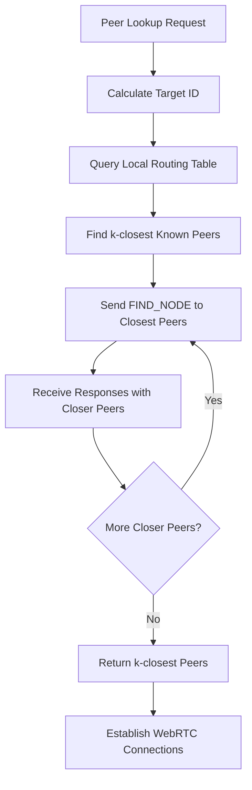
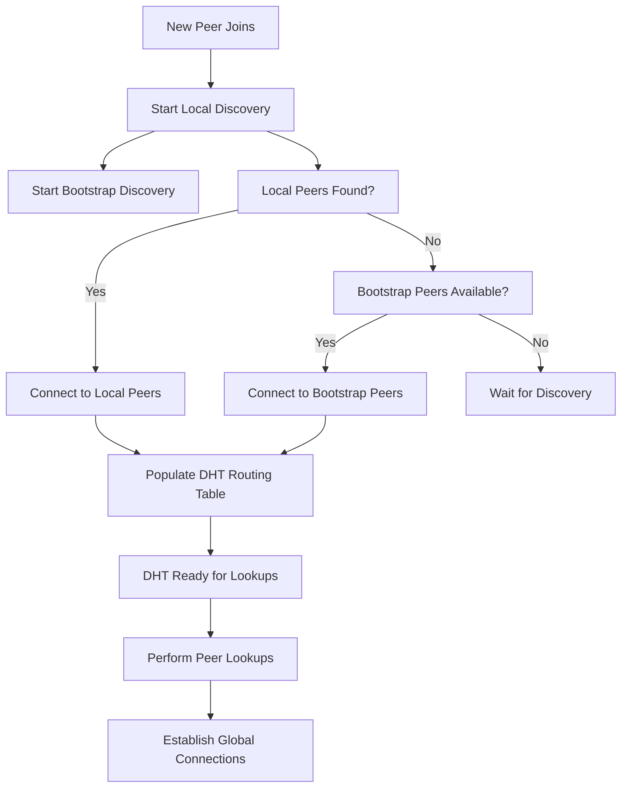

# Peer Discovery Architecture Design

## Overview

This document outlines a robust, multi-layered, and fully decentralized peer discovery architecture for the Sovereign Communications P2P network. The design integrates seamlessly with the Kademlia DHT-based routing system described in `SCALABLE_ROUTING_DESIGN.md`, ensuring complete P2P sovereignty without reliance on centralized discovery servers.

The architecture employs three complementary discovery layers that work together to provide resilient peer discovery across local and global networks:

1. **Decentralized Bootstrap Layer** - Initial network entry using well-known peer keys
2. **Local Peer Discovery Layer** - Proximity-based discovery using mDNS and Bluetooth LE
3. **DHT-Based Lookup Layer** - Global peer discovery through Kademlia DHT queries

## Architecture Principles

### Sovereignty and Decentralization
- **Zero Central Servers**: No reliance on centralized discovery infrastructure
- **Community Governance**: Bootstrap keys maintained by network participants
- **Self-Healing**: Network remains functional even if bootstrap peers go offline

### Multi-Layer Resilience
- **Progressive Discovery**: Local discovery provides immediate connectivity, DHT enables global reach
- **Fallback Mechanisms**: Each layer can operate independently or complement others
- **Scalability**: Design supports 1,000,000+ concurrent users through logarithmic DHT lookups

### Security Integration
- **Cryptographic Identity**: All peer discovery uses public key-based identity
- **Secure Handshakes**: WebRTC connections established with mutual authentication
- **Privacy Preservation**: No personally identifiable information exposed during discovery

## Layer 1: Decentralized Bootstrap Process

### Design Rationale
New peers need initial entry points to join the network. Traditional centralized bootstrap servers violate P2P sovereignty. This layer uses a decentralized approach with community-maintained bootstrap peer keys.

### Bootstrap Key Management
- **Well-Known Keys**: Pre-configured public keys of stable, long-running bootstrap peers
- **Community Curation**: Keys distributed through app updates and documentation
- **Rotation Mechanism**: Keys can be rotated through consensus or community agreement
- **Fallback Keys**: Multiple redundant keys ensure bootstrap availability

### Bootstrap Process
1. **Key Resolution**: Client loads well-known bootstrap keys from configuration
2. **Parallel Connection**: Attempt connection to multiple bootstrap peers simultaneously
3. **Initial Routing Table**: Bootstrap peers provide k-closest peers to populate local Kademlia routing table
4. **Handover**: Once routing table populated, client transitions to DHT-based discovery

### Bootstrap Peer Requirements
- **Stability**: Bootstrap peers should maintain high uptime
- **Neutrality**: Not affiliated with any single organization
- **Security**: Bootstrap peers validate connections but don't store user data
- **Load Distribution**: Multiple bootstrap peers prevent single points of failure

## Layer 2: Local Peer Discovery

### Design Rationale
Local network discovery provides immediate connectivity without requiring global network access. This layer leverages existing proximity discovery infrastructure while extending it with mDNS support.

### mDNS-Based Discovery
- **Service Name**: `_sovereign._tcp.local`
- **TXT Records**: Include peer public key, supported protocols, and capabilities
- **IPv4/IPv6 Support**: Dual-stack operation for maximum compatibility
- **Continuous Broadcasting**: Peers announce presence at regular intervals

### Bluetooth LE Integration
- **Service UUID**: Dedicated BLE service for Sovereign Communications
- **Advertisement Data**: Contains peer ID hash and connection capabilities
- **RSSI-Based Proximity**: Prioritizes nearby peers for connection
- **Low Energy Operation**: Minimizes battery impact on mobile devices

### Local Discovery Manager
```typescript
interface LocalDiscoveryConfig {
  mdnsEnabled: boolean;
  bleEnabled: boolean;
  scanInterval: number;
  serviceName: string;
  bleServiceUuid: string;
}

class LocalPeerDiscovery {
  private discoveredPeers: Map<string, LocalPeerInfo> = new Map();

  start(): void {
    if (config.mdnsEnabled) this.startMdnsDiscovery();
    if (config.bleEnabled) this.startBleDiscovery();
  }

  onPeerDiscovered(callback: (peer: LocalPeerInfo) => void): void;
  onPeerLost(callback: (peerId: string) => void): void;
}
```

### Integration with Global Network
- **Local-First Connections**: Prefer local peers for initial connections
- **DHT Population**: Local discoveries populate DHT routing table
- **Offline Operation**: Local layer functions without internet connectivity

## Layer 3: DHT-Based Peer Lookup

### Integration with Kademlia DHT
The DHT layer leverages the Kademlia routing system for global peer discovery. Peer lookup operations are integrated with the existing routing table and message relay system.

### Peer ID Generation
- **Hash-Based IDs**: Peer IDs derived from SHA-256 hash of public keys
- **XOR Distance Metric**: Standard Kademlia distance calculation
- **160-bit IDs**: Provides sufficient keyspace for large networks

### Lookup Protocol
1. **FIND_NODE Query**: Locate k-closest peers to target ID
2. **Iterative Lookup**: Query progressively closer peers until target found
3. **STORE Operations**: Peers store contact information in responsible nodes
4. **Value Retrieval**: Lookup returns peer contact information and endpoints

### Peer Announcement Mechanism
- **DHT Storage**: Peers store their contact info in DHT under their peer ID
- **Replication**: Contact info replicated across k-closest nodes
- **TTL Management**: Stored entries have configurable time-to-live
- **Refresh Protocol**: Peers periodically refresh their DHT entries

### Lookup Flow Diagram


## Multi-Layer Integration

### Discovery Coordinator
A central coordinator manages the interaction between discovery layers:

```typescript
class PeerDiscoveryCoordinator {
  private bootstrapDiscovery: BootstrapDiscovery;
  private localDiscovery: LocalPeerDiscovery;
  private dhtDiscovery: DHTPeerLookup;

  constructor() {
    this.bootstrapDiscovery = new BootstrapDiscovery();
    this.localDiscovery = new LocalPeerDiscovery();
    this.dhtDiscovery = new DHTPeerLookup();
  }

  async initializeNetwork(): Promise<void> {
    // Start all layers simultaneously
    await Promise.all([
      this.bootstrapDiscovery.start(),
      this.localDiscovery.start(),
      this.dhtDiscovery.initialize()
    ]);
  }
}
```

### Layer Priority and Fallback
1. **Primary**: Local discovery for immediate connectivity
2. **Secondary**: Bootstrap peers for initial network entry
3. **Tertiary**: DHT lookups for specific peer location
4. **Fallback**: Each layer can compensate for others' failures

### Connection Establishment Flow


## Security Considerations

### Authentication
- **Public Key Verification**: All discovered peers authenticated via public keys
- **Certificate Pinning**: Bootstrap keys pinned to prevent MITM attacks
- **Signature Validation**: All discovery messages cryptographically signed

### Privacy Protection
- **No Metadata Leakage**: Discovery doesn't expose user information
- **Ephemeral IDs**: Temporary identifiers used where possible
- **Traffic Analysis Resistance**: Discovery patterns don't reveal social graphs

### Attack Mitigation
- **Sybil Attack Protection**: DHT routing table management prevents attack
- **Eclipse Attacks**: Multi-layer discovery prevents single-layer compromise
- **DoS Resistance**: Rate limiting and validation on all discovery operations

## Implementation Integration Points

### Core Module Integration
- **Routing Table Updates**: Discovery layers feed into Kademlia routing table
- **Network Manager Hooks**: Discovery events trigger connection establishment
- **Persistence Layer**: Discovered peers cached across sessions

### Platform-Specific Considerations
- **Web Platform**: mDNS via WebRTC data channels, BLE via Web Bluetooth API
- **Mobile Platforms**: Native mDNS and BLE implementations
- **Desktop Platforms**: System-level service discovery APIs

### Configuration Management
```typescript
interface DiscoveryConfig {
  bootstrap: {
    enabled: boolean;
    keys: string[]; // Array of hex-encoded public keys
    timeout: number;
  };
  local: {
    mdns: boolean;
    bluetooth: boolean;
    scanInterval: number;
  };
  dht: {
    k: number; // Bucket size
    alpha: number; // Parallel lookup count
    storeTtl: number;
  };
}
```

## Performance Characteristics

### Scalability Metrics
- **Bootstrap**: O(1) with fixed number of bootstrap peers
- **Local Discovery**: O(n) where n is local network size
- **DHT Lookup**: O(log n) for network size n

### Resource Usage
- **Memory**: Routing table ~O(log n) entries
- **Network**: Minimal overhead for discovery operations
- **Battery**: Local discovery optimized for low power consumption

## Migration Strategy

### Phased Rollout
1. **Phase 1**: Implement local and bootstrap layers alongside existing discovery
2. **Phase 2**: Integrate DHT discovery with Kademlia routing
3. **Phase 3**: Deprecate centralized discovery methods
4. **Phase 4**: Full sovereignty with DHT-only discovery

### Backward Compatibility
- **Existing Connections**: Maintain support for current peer discovery methods
- **Gradual Transition**: New clients use multi-layer discovery, old clients supported
- **Feature Flags**: Enable/disable layers independently during rollout

## Conclusion

This multi-layered peer discovery architecture provides robust, decentralized discovery capabilities that scale to millions of users while maintaining complete P2P sovereignty. The integration with Kademlia DHT ensures efficient global peer location, while local discovery provides immediate connectivity. The decentralized bootstrap process eliminates reliance on centralized infrastructure, creating a truly sovereign P2P network.