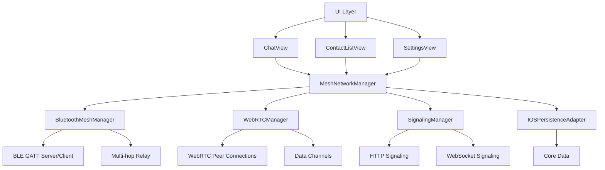

# iOS Mesh Networking Implementation Plan

## Overview

This plan outlines the implementation of full P2P mesh networking sovereignty for the iOS platform, bringing feature parity with Android and Web implementations. The core architecture will follow the unified @sc/core design, integrating with existing Sovereign Communications components.

## Architecture Overview

## Core Components Implementation

### 1. MeshNetworkManager.swift Implementation

**Key Responsibilities:**
- Coordinate Bluetooth and WebRTC transports
- Manage peer connections and routing
- Handle message queuing and persistence
- Provide unified API for mesh networking

**Core Features:**
- **Peer Management:** Track connected peers across transports
- **Message Routing:** Flood routing and direct routing based on connection type
- **Store-and-Forward:** Queue messages for offline peers using IOSPersistenceAdapter
- **Heartbeat/Ping-Pong:** Maintain connection health with latency monitoring
- **Rate Limiting:** Prevent message spam (60 messages/minute, 1000/hour)
- **Connection Monitoring:** Track bandwidth, latency, packet loss

**Integration Points:**
- Use `IOSPersistenceAdapter` for message queue persistence
- Integrate with `CoreDataStack` for message and conversation storage
- Coordinate with `BluetoothMeshManager` and `WebRTCManager`
- Support both LAN (BLE/WebRTC) and WAN (signaling server) connectivity

### 2. WebRTC Integration

**WebRTCManager Implementation:**
- Initialize WebRTC peer connection factory
- Create and manage peer connections with data channels
- Handle ICE candidate exchange via signaling
- Support reliable and unreliable data channels
- Manage connection states (connecting, connected, failed, disconnected)
- Implement reconnection logic for failed connections

**Key Classes:**
- `WebRTCManager`: Main WebRTC coordinator
- `PeerConnectionWrapper`: Wrapper for RTC peer connections
- `DataChannelObserver`: Handle data channel events
- `SignalingDelegate`: Interface for ICE candidate/signaling exchange

**Signaling Integration:**
- HTTP signaling for public rooms (WAN support)
- WebSocket signaling for persistent signaling servers
- Manual SDP exchange for direct peer connections
- BLE-based signaling as fallback for LAN connections

### 3. UI Components for Feature Parity

**Required Views (matching Android/Web):**

1. **ChatView Enhancement:**
   - Message bubbles with timestamps and status indicators
   - File attachment support with MediaPickerManager
   - Message status (pending, sent, delivered, read)
   - Typing indicators and read receipts
   - Message encryption indicators

2. **ContactListView:**
   - Display discovered and connected peers
   - Contact management (add, remove, block)
   - Online/offline status indicators
   - Peer capabilities display (BLE, WebRTC, etc.)

3. **ConversationListView:**
   - List of active conversations
   - Unread message counts
   - Last message preview
   - Conversation timestamps

4. **SettingsView:**
   - Network diagnostics
   - Connection status
   - Privacy settings
   - Data usage statistics
   - Peer management

5. **Additional Views:**
   - PeerDiscoveryView: Nearby peer discovery interface
   - FileTransferProgressView: File transfer status
   - NetworkDiagnosticsView: Detailed network stats
   - InviteHandlingView: QR code invite generation/scanning

**ViewModel Layer:**
- `ChatViewModel`: Message sending/receiving, file handling
- `ContactViewModel`: Peer management and discovery
- `SettingsViewModel`: Configuration and diagnostics

### 4. Data Persistence with Core Data

**Core Data Integration:**
- Extend existing `MessageEntity`, `ConversationEntity`, `ContactEntity`
- Add peer connection metadata storage
- Message queue persistence via `IOSPersistenceAdapter`
- Offline message caching

**PersistenceAdapter Implementation:**
- `IOSPersistenceAdapter`: Bridge between core and iOS persistence
- Message serialization/deserialization
- Queue management with expiration
- Backup and restore integration

### 5. Bluetooth Low Energy (BLE) Implementation

**BluetoothMeshManager Implementation:**
- GATT server for incoming connections
- GATT client for outgoing connections
- Multi-hop relay for extended range
- Store-and-forward for offline delivery
- BLE advertisement for peer discovery

**Key Features:**
- Proximity-based peer discovery
- Low-power mesh networking
- Automatic connection management
- Fallback transport when WebRTC unavailable

## Implementation Timeline and Task Breakdown

### Phase 1: Core Infrastructure (Foundation)

1. Complete `WebRTCManager` implementation
   - Peer connection factory setup
   - Data channel creation and management
   - ICE candidate handling
   - Connection state management

2. Implement `BluetoothMeshManager`
   - BLE GATT server/client setup
   - Peer discovery via BLE advertisement
   - Basic message transmission
   - Connection lifecycle management

3. Enhance `MeshNetworkManager`
   - Transport coordination logic
   - Message routing between BLE/WebRTC
   - Basic store-and-forward implementation
   - Peer connection tracking

### Phase 2: Signaling and Discovery

4. Implement SignalingManager
   - HTTP signaling client for public rooms
   - WebSocket signaling client
   - Manual SDP exchange support
   - Signaling message encryption

5. Peer Discovery Implementation
   - BLE-based discovery
   - Signaling server discovery
   - Peer announcement broadcasting
   - Discovery state management

### Phase 3: Advanced Features

6. Routing Algorithm Enhancement
   - Flood routing implementation
   - Direct routing optimization
   - Multi-hop relay logic
   - Route metrics and optimization

7. Store-and-Forward System
   - Message queuing with persistence
   - Expiration and cleanup logic
   - Retry mechanisms
   - Queue prioritization

8. Connection Monitoring
   - Heartbeat/ping-pong implementation
   - Latency and bandwidth tracking
   - Connection quality assessment
   - Automatic reconnection

### Phase 4: UI Feature Parity

9. Enhance ChatView
   - File attachment support
   - Message status indicators
   - Typing indicators
   - Message encryption UI

10. Implement ContactListView
    - Peer list management
    - Online status tracking
    - Contact CRUD operations

11. Settings and Diagnostics
    - Network status display
    - Connection diagnostics
    - Data usage tracking
    - Privacy controls

### Phase 5: Testing and Optimization

12. Integration Testing
    - End-to-end message transmission
    - Multi-peer connectivity
    - Offline message delivery
    - Cross-transport routing

13. Performance Optimization
    - Memory management for connections
    - Battery optimization for BLE
    - Data compression for messages
    - Connection pooling

14. Security Hardening
    - Message encryption verification
    - Peer authentication
    - Secure signaling channels
    - Privacy protection measures

## Security Considerations

- **End-to-End Encryption:** Ensure all messages are encrypted using core crypto primitives
- **Peer Authentication:** Verify peer identities before establishing connections
- **Signaling Security:** Encrypt signaling messages and use secure channels
- **Data Sanitization:** Validate all incoming messages and file attachments
- **Permission Management:** Proper iOS permissions for BLE, camera, microphone access

## Testing Strategy

- **Unit Tests:** Individual component testing (WebRTC, BLE, persistence)
- **Integration Tests:** Transport coordination and message routing
- **End-to-End Tests:** Full mesh networking scenarios
- **Performance Tests:** Connection scaling, message throughput, battery impact
- **Security Tests:** Encryption validation, authentication testing

## Dependencies and Prerequisites

- WebRTC.framework (via CocoaPods or Swift Package Manager)
- CoreBluetooth framework
- Existing Sovereign Communications infrastructure (Core Data, persistence adapters)
- @sc/core integration for unified architecture

This implementation plan ensures the iOS platform achieves full feature parity with Android and Web implementations while maintaining the sovereign, decentralized nature of the mesh network.